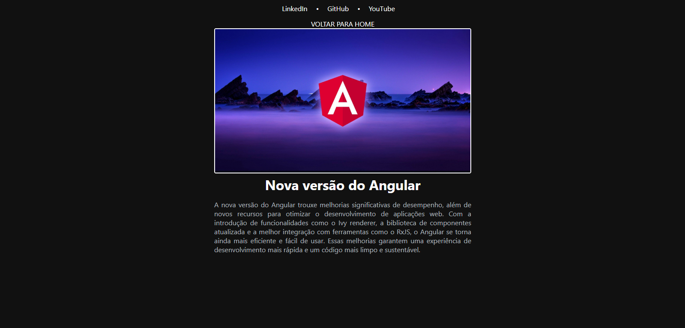

# Blog pessoal sobre tecnologia
Este projeto foi desenvolvido utilizando o framework Angular, com foco na criação de um blog responsivo e moderno. A ideia central foi originada por [Felipe](https://github.com/felipeAguiarCode/angular-blog), que inicialmente encontrou um layout de [blog no Dribbble](https://dribbble.com/shots/18089191-Blog-Layout) e utilizou-o como base para a implementação do front-end.

## Etapas de Desenvolvimento:
- **Pesquisa e Organização:** Felipe começou o desenvolvimento analisando o layout do blog, identificando e organizando os componentes principais, como o _menu-bar_, _menu-title_, _big-card_ e _small-card_. Essas ideias estão armazenadas na pasta [/ideas](https://github.com/wastecoder/angular-blog-dio/tree/main/.ideas) para melhor visualização e planejamento.
- **Implementação dos Componentes:** Com base nas ideias capturadas, Felipe criou os componentes mencionados, focando na estrutura e organização do projeto.
- **Personalização:** A partir desse ponto, personalizei realizando alterando as imagens e textos, mantendo a estrutura original, mas adaptando os elementos de acordo com as necessidades do projeto.
- **Novo Componente - vertical-card:** Para aprimorar o projeto e praticar habilidades de desenvolvimento, implementei um novo componente chamado _vertical-card_. Esse componente foi inspirado no layout original do Dribbble, mas que Felipe não havia implementado. O vertical-card foi criado para adicionar mais flexibilidade e visual dinâmico ao blog.


## Instalação
1. Clone o projeto na pasta desejada:
```bash
git clone https://github.com/wastecoder/angular-blog-dio.git
```
2. Baixe as dependências do projeto
```bash
npm install
```
  - O comando acima criará a pasta "node_modules"
3. Execute o projeto localmente
```bash
ng s -o
```
  - Isso irá iniciar e abrir o projeto na porta 4200.

## Imagens do Projeto

### Página inicial (zoom out)
.png)

### Página inicial (normal)
.png)

### Postagem

